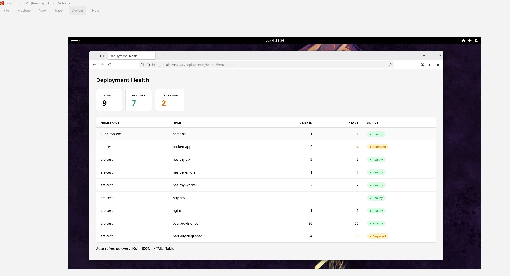

# Task 1 — Deployment Health Check

**As an SRE I want to know whether all the deployments in the k8s cluster have as many healthy pods as requested by the respective `Deployment` spec.**

---

## Health Definition

A deployment is considered **healthy** when:

```
readyReplicas == desiredReplicas  AND  desiredReplicas > 0
```

A deployment explicitly scaled to zero replicas is reported as **unhealthy** — with no pods running the workload cannot serve traffic, and the SRE needs to be aware of it.

---

## Endpoint

All three formats are served from the same URL. The `?format=` query parameter selects the response type.

| URL | Response | Use case |
|-----|----------|----------|
| `/deployments/health` | JSON | Scripts, monitoring tools, alerting pipelines |
| `/deployments/health?format=html` | HTML dashboard | Browser — card + badge view, auto-refreshes every 10s |
| `/deployments/health?format=table` | HTML spreadsheet | Browser — Excel-style grid, auto-refreshes every 10s |

---

## HTTP Status Codes

The same status code rules apply regardless of which format is requested.

| Code | Meaning |
|------|---------|
| `200 OK` | Every deployment has all requested pods ready (or there are none) |
| `503 Service Unavailable` | One or more deployments are degraded |
| `500 Internal Server Error` | The Kubernetes API could not be reached |

---

## Test Environment

A Kubernetes Minikube setup having 2 clusters was created on a Centos 10 VM.

```bash
minikube profile list
```

| PROFILE  | DRIVER | RUNTIME | IP           | VERSION | STATUS | NODES | ACTIVE PROFILE | ACTIVE KUBECONTEXT |
|----------|--------|---------|--------------|---------|--------|-------|----------------|--------------------|
| clusterA | docker | docker  | 192.168.49.2 | v1.35.1 | OK     | 1     | *              | *                  |
| clusterB | docker | docker  | 192.168.58.2 | v1.35.1 | OK     | 1     |                |                    |

```bash
kubectl get deployment -n sre-test --context=clusterA
```

| NAME               | READY | UP-TO-DATE | AVAILABLE | AGE   |
|--------------------|-------|------------|-----------|-------|
| good-app           | 20/20 | 20         | 20        | 3h50m |
| httpenv            | 5/5   | 5          | 5         | 3h50m |
| low-mem-app        | 0/3   | 1          | 0         | 3h23m |
| partially-degraded | 3/4   | 2          | 3         | 3h50m |

```bash
kubectl get deployment -n sre-test --context=clusterB
```

| NAME         | READY | UP-TO-DATE | AVAILABLE | AGE   |
|--------------|-------|------------|-----------|-------|
| healthy-app1 | 3/3   | 3          | 3         | 13h   |
| healthy-app2 | 2/2   | 2          | 2         | 13h   |
| healthy-web  | 5/5   | 5          | 5         | 13h   |
| low-cpu-app  | 0/3   | 3          | 0         | 3m1s  |

---

## Running the Tool

### Outside the cluster (local development)

**Terminal 1 — start the server and keep it running:**

```bash
cd ~/tyk-sre-assignment/golang
go run main.go --kubeconfig ~/.kube/config
```

> Note: `go run main.go` takes 10-20 seconds because it compiles from source on every run. Build the binary once for faster subsequent starts:

```bash
cd ~/tyk-sre-assignment/golang
go build -o sre-tool .
./sre-tool --kubeconfig ~/.kube/config
```

The tool reads all contexts from the kubeconfig and presents an interactive selection:

```
SRE Tool starting — reading cluster configuration...

Available clusters:
  [1] clusterA
  [2] clusterB
  [a] All clusters

Select a cluster (1-2) or 'a' for all:
```

Select a cluster by number or `a` for all. The tool starts one server per selected cluster, reports unavailable ports, and automatically finds the next available port from `:8080` upward:

```
Starting server for all clusters...
=================================================================
  Cluster: clusterA
  URL:     http://localhost:8080  (Kubernetes v1.35.1)

  From a second terminal run the following commands:
    curl -s http://localhost:8080/deployments/health | jq .
    curl -s http://localhost:8080/healthz | jq .
    Browser: http://localhost:8080/deployments/health?format=html
    Browser: http://localhost:8080/healthz?format=html
Server listening on :8080
=================================================================
  Cluster: clusterB
  URL:     http://localhost:8081  (Kubernetes v1.35.1)

  From a second terminal run the following commands:
    curl -s http://localhost:8081/deployments/health | jq .
    curl -s http://localhost:8081/healthz | jq .
    Browser: http://localhost:8081/deployments/health?format=html
    Browser: http://localhost:8081/healthz?format=html
Server listening on :8081
=================================================================
```

> The server must stay running in Terminal 1. Open a second terminal to run the curl and browser commands printed above.

---

### Inside the cluster — minikube

When deployed as a pod via Helm, the tool runs without any flags. Kubernetes automatically mounts a service account token into the pod at `/var/run/secrets/kubernetes.io/serviceaccount/token`. The `client-go` library detects this token and uses it to authenticate against the API server — no `--kubeconfig` needed.

> All `helm` commands must be run from the repo root (`~/tyk-sre-assignment`).

```bash
cd ~/tyk-sre-assignment

# Check if already installed
helm list

# First time install
helm install sre-tool ./helm/sre-tool --set service.type=NodePort

# Already installed — upgrade instead
helm upgrade sre-tool ./helm/sre-tool --set service.type=NodePort

# Verify the pod is running
kubectl get pods -l app.kubernetes.io/name=sre-tool

# Check the logs to confirm it connected to the cluster
kubectl logs -l app.kubernetes.io/name=sre-tool
# Expected output:
# Connected to Kubernetes v1.35.1
# Server listening on :8080

# Get the minikube URL
minikube service sre-tool --url
# Example: http://192.168.49.2:30318

# Query the endpoints using the minikube URL
curl -s http://192.168.49.2:30318/deployments/health | jq .
curl -s http://192.168.49.2:30318/healthz | jq .

# Browser
http://192.168.49.2:30318/deployments/health?format=html
http://192.168.49.2:30318/deployments/health?format=table
http://192.168.49.2:30318/healthz?format=html
```

The warning `Neither --kubeconfig nor --master was specified` in the logs is harmless — it is `client-go` confirming it detected the in-cluster token and is using it.

---

### Inside the cluster — AWS EKS

The default service type is `LoadBalancer`. On EKS this automatically provisions an AWS Load Balancer with a public DNS name — no security group changes or VPN access required.

> All `helm` commands must be run from the repo root (`~/tyk-sre-assignment`).

```bash
cd ~/tyk-sre-assignment

# Point kubectl at your EKS cluster
aws eks update-kubeconfig --region <your-region> --name <your-cluster-name>

# Check if already installed
helm list

# First time install (LoadBalancer is the default — no override needed)
helm install sre-tool ./helm/sre-tool

# Already installed — upgrade instead
helm upgrade sre-tool ./helm/sre-tool

# Wait for the pod to be ready
kubectl get pods -w -l app.kubernetes.io/name=sre-tool

# Check the logs to confirm it connected to the cluster
kubectl logs -l app.kubernetes.io/name=sre-tool
# Expected output:
# Connected to Kubernetes v1.x.x
# Server listening on :8080

# Get the public DNS name assigned by AWS.
# The EXTERNAL-IP column shows the load balancer address.
# This may take 1-2 minutes to appear while AWS provisions the load balancer.
kubectl get svc sre-tool
```

Once `EXTERNAL-IP` is populated:

```bash
# JSON endpoints
curl -s http://<EXTERNAL-IP>:8080/healthz | jq .
curl -s http://<EXTERNAL-IP>:8080/deployments/health | jq .

# Browser — accessible from any machine including Windows
http://<EXTERNAL-IP>:8080/deployments/health?format=html
http://<EXTERNAL-IP>:8080/deployments/health?format=table
http://<EXTERNAL-IP>:8080/healthz?format=html
```

---

## Live Output — JSON

```bash
curl -s http://localhost:8080/deployments/health | jq .
```

```json
{
  "cluster": "clusterA",
  "deployments": [
    {
      "name": "coredns",
      "namespace": "kube-system",
      "desiredReplicas": 1,
      "readyReplicas": 1,
      "healthy": true
    },
    {
      "name": "good-app",
      "namespace": "sre-test",
      "desiredReplicas": 20,
      "readyReplicas": 20,
      "healthy": true
    },
    {
      "name": "httpenv",
      "namespace": "sre-test",
      "desiredReplicas": 5,
      "readyReplicas": 5,
      "healthy": true
    },
    {
      "name": "low-mem-app",
      "namespace": "sre-test",
      "desiredReplicas": 3,
      "readyReplicas": 0,
      "healthy": false
    },
    {
      "name": "partially-degraded",
      "namespace": "sre-test",
      "desiredReplicas": 4,
      "readyReplicas": 3,
      "healthy": false
    }
  ],
  "allHealthy": false
}
```

The top-level `cluster` field identifies which cluster the response is for. The `allHealthy` flag lets callers check cluster health in a single field without iterating the full list.

---

## Live Output — HTML Dashboard

`http://localhost:8080/deployments/health?format=html`



The dashboard shows:
- **Cluster name** in the page title — `Deployment Health — clusterA`
- **Summary cards** — Total, Healthy (green), Degraded (orange) counts at a glance
- **Per-deployment table** — Namespace, Name, Desired replicas, Ready replicas (orange when degraded), Status badge
- **Auto-refresh** every 10 seconds — no manual reload needed
- **Footer links** to switch between JSON, HTML and Table views

---

## In-memory test

```bash
cd ~/tyk-sre-assignment/golang
go test ./... -v
```

---

## In-memory test result

```
=== RUN   TestGetKubernetesVersion
--- PASS: TestGetKubernetesVersion (0.00s)
=== RUN   TestHealthHandler
--- PASS: TestHealthHandler (0.00s)
=== RUN   TestGetDeploymentsHealth_NoDeployments
--- PASS: TestGetDeploymentsHealth_NoDeployments (0.00s)
=== RUN   TestGetDeploymentsHealth_AllHealthy
--- PASS: TestGetDeploymentsHealth_AllHealthy (0.00s)
=== RUN   TestGetDeploymentsHealth_PartiallyUnhealthy
--- PASS: TestGetDeploymentsHealth_PartiallyUnhealthy (0.00s)
=== RUN   TestGetDeploymentsHealth_ZeroDesiredReplicas
--- PASS: TestGetDeploymentsHealth_ZeroDesiredReplicas (0.00s)
=== RUN   TestGetDeploymentsHealth_MultiNamespace
--- PASS: TestGetDeploymentsHealth_MultiNamespace (0.00s)
=== RUN   TestDeploymentsHealthHandler_AllHealthy
--- PASS: TestDeploymentsHealthHandler_AllHealthy (0.00s)
=== RUN   TestDeploymentsHealthHandler_Unhealthy
--- PASS: TestDeploymentsHealthHandler_Unhealthy (0.00s)
=== RUN   TestDeploymentsHealthHandler_NoDeployments
--- PASS: TestDeploymentsHealthHandler_NoDeployments (0.00s)
=== RUN   TestDeploymentsHealthHandler_HTML_200
--- PASS: TestDeploymentsHealthHandler_HTML_200 (0.00s)
=== RUN   TestDeploymentsHealthHandler_HTML_503
--- PASS: TestDeploymentsHealthHandler_HTML_503 (0.00s)
=== RUN   TestHealthzHandler_APIReachable
--- PASS: TestHealthzHandler_APIReachable (0.00s)
=== RUN   TestHealthzHandler_HTML_200
--- PASS: TestHealthzHandler_HTML_200 (0.00s)
=== RUN   TestHealthzHandler_APIUnreachable
--- PASS: TestHealthzHandler_APIUnreachable (0.00s)
=== RUN   TestHealthzHandler_HTML_503
--- PASS: TestHealthzHandler_HTML_503 (0.00s)
PASS
ok      github.com/TykTechnologies/tyk-sre-assignment   0.454s
```

All 16 tests run against a **fake in-memory Kubernetes client** — no cluster is required.

---

## Implementation Notes

- **Business logic is separated from the HTTP layer.** `getDeploymentsHealth` accepts a `context.Context` and a `kubernetes.Interface` and returns a plain struct. This makes it trivially testable without spinning up an HTTP server.
- **Three response formats share one handler.** `deploymentsHealthHandler` reads `?format=` and delegates to `renderJSON`, `renderHTML`, or `renderTable`. The HTTP status code (200 vs 503) is computed once and passed to whichever renderer is called.
- **HTML rendering uses `html/template`.** Go's `html/template` package automatically escapes all values inserted into the page.
- **Auto-refresh.** A `<meta http-equiv="refresh" content="10">` tag in the HTML `<head>` instructs the browser to reload every 10 seconds, keeping the dashboard current without any client-side code.
- **In memory test.** In memory tests use `fake.NewSimpleClientset()` from `k8s.io/client-go/kubernetes/fake` — an in-memory Kubernetes client that returns whatever objects you seed it with. This makes the test suite fast and fully self-contained.
- **In-cluster authentication is automatic.** When no `--kubeconfig` flag is provided, `client-go` detects the pod's mounted service account token and uses it to authenticate — the same binary works both locally and inside the cluster without any code changes.
- **Multi-cluster support.** At startup the tool reads all contexts from the kubeconfig file dynamically. The operator selects one cluster or all. One independent HTTP server is started per selected cluster, each automatically assigned the next available port from `:8080` upward. Adding a new cluster to the kubeconfig requires no code changes — it appears automatically in the selection list on the next run.
- **Cluster name in responses.** Every JSON response and HTML dashboard title includes the cluster name so the operator always knows which cluster the data is for.
