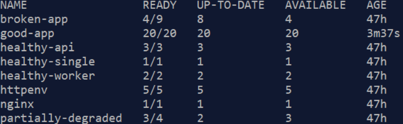

# Task 1 — Deployment Health Check

> **As an SRE I want to know whether all the deployments in the k8s cluster have as many healthy pods as requested by the respective `Deployment` spec.**

---

## Health Definition

A deployment is considered **healthy** when:

```
readyReplicas == desiredReplicas  AND  desiredReplicas > 0
```

A deployment explicitly scaled to zero replicas is reported as **unhealthy** — with no pods running the workload cannot serve traffic, and the SRE needs to be aware of it.

---

## Endpoint

All three formats are served from the same URL. The `?format=` query parameter selects the response type.

| URL | Response | Use case |
|-----|----------|----------|
| `/deployments/health` | JSON | Scripts, monitoring tools, alerting pipelines |
| `/deployments/health?format=html` | HTML dashboard | Browser — card + badge view, auto-refreshes every 10s |
| `/deployments/health?format=table` | HTML spreadsheet | Browser — Excel-style grid, auto-refreshes every 10s |

---

## HTTP Status Codes

The same status code rules apply regardless of which format is requested.

| Code | Meaning |
|------|---------|
| `200 OK` | Every deployment has all requested pods ready (or there are none) |
| `503 Service Unavailable` | One or more deployments are degraded |
| `500 Internal Server Error` | The Kubernetes API could not be reached |

---
## Test Environment
8 deployments were created on kubernetes minikube



---

## Running the Tool

### Outside the cluster (local development)

**Terminal 1 — start the server and keep it running:**

```bash
cd ~/tyk-sre-assignment/golang
go run main.go --kubeconfig ~/.kube/config

# Output:
# Connected to Kubernetes v1.35.1
# Server listening on :8080
```


> The server must stay running in Terminal 1. Open a second terminal for all subsequent commands.

**Terminal 2 — query the endpoints:**

```bash
# Deployment health — JSON
curl -s http://localhost:8080/deployments/health | jq .
```

**Browser:**
```
http://localhost:8080/deployments/health?format=html
http://localhost:8080/deployments/health?format=table
http://localhost:8080/healthz?format=html
```

### Inside the cluster (Helm deployment)

When deployed as a pod via Helm, the tool runs without any flags. Kubernetes automatically mounts a service account token into the pod at `/var/run/secrets/kubernetes.io/serviceaccount/token`. The `client-go` library detects this token and uses it to authenticate against the API server — no `--kubeconfig` needed.

> All `helm` commands must be run from the repo root (`~/tyk-sre-assignment`).

```bash
# Check if already installed
cd ~/tyk-sre-assignment
helm list

# First time install (minikube)
helm install sre-tool ./helm/sre-tool --set service.type=NodePort

# Already installed — upgrade instead
helm upgrade sre-tool ./helm/sre-tool --set service.type=NodePort

# Verify the pod is running
kubectl get pods -l app.kubernetes.io/name=sre-tool

# Check the logs to confirm it connected to the cluster
kubectl logs -l app.kubernetes.io/name=sre-tool
# Expected output:
# Connected to Kubernetes v1.35.1
# Server listening on :8080

# Get the minikube URL
minikube service sre-tool --url
# Example: http://192.*.*.*:30318

# Query the endpoints using the minikube URL
curl -s http://192.*.*.*:30318/deployments/health | jq .
curl -s http://192.*.*.*:30318/healthz | jq .
```

The warning `Neither --kubeconfig nor --master was specified` in the logs is harmless — it is `client-go` confirming it detected the in-cluster token and is using it.

---

## Live Output — JSON

```bash
curl -s http://localhost:8080/deployments/health | jq .
```

```json
{
  "deployments": [
    {
      "name": "coredns",
      "namespace": "kube-system",
      "desiredReplicas": 1,
      "readyReplicas": 1,
      "healthy": true
    },
    {
      "name": "broken-app",
      "namespace": "sre-test",
      "desiredReplicas": 9,
      "readyReplicas": 4,
      "healthy": false
    },
    {
      "name": "healthy-api",
      "namespace": "sre-test",
      "desiredReplicas": 3,
      "readyReplicas": 3,
      "healthy": true
    },
    {
      "name": "healthy-single",
      "namespace": "sre-test",
      "desiredReplicas": 1,
      "readyReplicas": 1,
      "healthy": true
    },
    {
      "name": "healthy-worker",
      "namespace": "sre-test",
      "desiredReplicas": 2,
      "readyReplicas": 2,
      "healthy": true
    },
    {
      "name": "httpenv",
      "namespace": "sre-test",
      "desiredReplicas": 5,
      "readyReplicas": 5,
      "healthy": true
    },
    {
      "name": "nginx",
      "namespace": "sre-test",
      "desiredReplicas": 1,
      "readyReplicas": 1,
      "healthy": true
    },
    {
      "name": "good-app",
      "namespace": "sre-test",
      "desiredReplicas": 20,
      "readyReplicas": 20,
      "healthy": true
    },
    {
      "name": "partially-degraded",
      "namespace": "sre-test",
      "desiredReplicas": 4,
      "readyReplicas": 3,
      "healthy": false
    }
  ],
  "allHealthy": false
}
```

The top-level `allHealthy` flag lets callers check cluster health in a single field without iterating the full list. Here it is `false` because `broken-app` (4 of 9 ready) and `partially-degraded` (3 of 4 ready) are degraded.

---

## Live Output — HTML Dashboard

`http://localhost:8080/deployments/health?format=html`


The dashboard shows:
- **Summary cards** — Total, Healthy (green), Degraded (orange) counts at a glance
- **Per-deployment table** — Namespace, Name, Desired replicas, Ready replicas (orange when degraded), Status badge
- **Auto-refresh** every 10 seconds — no manual reload needed
- **Footer links** to switch between JSON, HTML and Table views

---

## In-memory test

```bash
cd ~/tyk-sre-assignment/golang
go test ./... -v
```

---

## In-memory test result

```
=== RUN   TestGetKubernetesVersion
--- PASS: TestGetKubernetesVersion (0.00s)
=== RUN   TestHealthHandler
--- PASS: TestHealthHandler (0.00s)
=== RUN   TestGetDeploymentsHealth_NoDeployments
--- PASS: TestGetDeploymentsHealth_NoDeployments (0.00s)
=== RUN   TestGetDeploymentsHealth_AllHealthy
--- PASS: TestGetDeploymentsHealth_AllHealthy (0.00s)
=== RUN   TestGetDeploymentsHealth_PartiallyUnhealthy
--- PASS: TestGetDeploymentsHealth_PartiallyUnhealthy (0.00s)
=== RUN   TestGetDeploymentsHealth_ZeroDesiredReplicas
--- PASS: TestGetDeploymentsHealth_ZeroDesiredReplicas (0.00s)
=== RUN   TestGetDeploymentsHealth_MultiNamespace
--- PASS: TestGetDeploymentsHealth_MultiNamespace (0.00s)
=== RUN   TestDeploymentsHealthHandler_AllHealthy
--- PASS: TestDeploymentsHealthHandler_AllHealthy (0.00s)
=== RUN   TestDeploymentsHealthHandler_Unhealthy
--- PASS: TestDeploymentsHealthHandler_Unhealthy (0.00s)
=== RUN   TestDeploymentsHealthHandler_NoDeployments
--- PASS: TestDeploymentsHealthHandler_NoDeployments (0.00s)
=== RUN   TestDeploymentsHealthHandler_HTML_200
--- PASS: TestDeploymentsHealthHandler_HTML_200 (0.00s)
=== RUN   TestDeploymentsHealthHandler_HTML_503
--- PASS: TestDeploymentsHealthHandler_HTML_503 (0.00s)
PASS
ok      github.com/TykTechnologies/tyk-sre-assignment   0.135s
```

All 12 tests run against a **fake in-memory Kubernetes client** — no cluster is required.

---

## Implementation Notes

- **Business logic is separated from the HTTP layer.** `getDeploymentsHealth` accepts a `context.Context` and a `kubernetes.Interface` and returns a plain struct. This makes it trivially testable without spinning up an HTTP server.
- **Three response formats share one handler.** `deploymentsHealthHandler` reads `?format=` and delegates to `renderJSON`, `renderHTML`, or `renderTable`. The HTTP status code (200 vs 503) is computed once and passed to whichever renderer is called.
- **HTML rendering uses `html/template`.** Go's `html/template` package automatically escapes all values inserted into the page, preventing XSS attacks — no sanitisation code needed.
- **Auto-refresh uses no JavaScript.** A `<meta http-equiv="refresh" content="10">` tag in the HTML `<head>` instructs the browser to reload every 10 seconds, keeping the dashboard current without any client-side code.
- **Tests require no cluster.** All tests use `fake.NewSimpleClientset()` from `k8s.io/client-go/kubernetes/fake` — an in-memory Kubernetes client that returns whatever objects you seed it with. This makes the test suite fast and fully self-contained.
- **In-cluster authentication is automatic.** When no `--kubeconfig` flag is provided, `client-go` detects the pod's mounted service account token and uses it to authenticate — the same binary works both locally and inside the cluster without any code changes.
