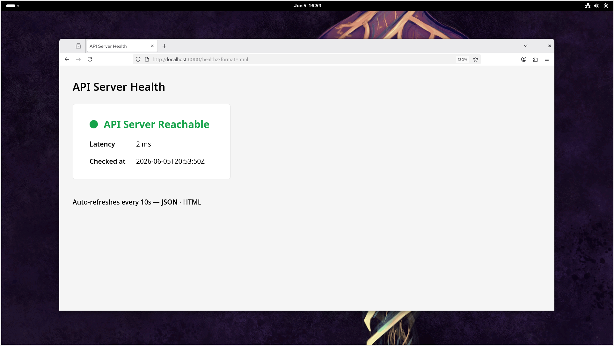

# Task 2 — API Server Health Check

**As an SRE I want to always know whether this tool can successfully communicate with the configured k8s API server.**

---

## What Was Built

The existing `/healthz` endpoint previously returned a static plain-text `ok` response — it only confirmed the process was alive, not that it could talk to Kubernetes.

It now actively probes the Kubernetes API server on every request by calling `Discovery().ServerVersion()`, which hits the `/version` endpoint on the API server. This is the lightest possible authenticated Kubernetes API call. The round-trip latency is measured and included in the response.

---

## Endpoint

| URL | Response | Use case |
|-----|----------|----------|
| `/healthz` | JSON | Scripts, monitoring tools, alerting pipelines |
| `/healthz?format=html` | HTML dashboard | Browser — green/red indicator, auto-refreshes every 10s |

---

## HTTP Status Codes

| Code | Meaning |
|------|---------|
| `200 OK` | API server responded successfully |
| `503 Service Unavailable` | API server unreachable or returned an error |

---

## Running the Tool

### Outside the cluster (local development)

```bash
cd ~/tyk-sre-assignment/golang
go run main.go --kubeconfig ~/.kube/config
```

The tool presents an interactive cluster selection:

```
SRE Tool starting — reading cluster configuration...

Available clusters:
  [1] clusterA
  [2] clusterB
  [a] All clusters

Select a cluster (1-2) or 'a' for all:
```

Once a cluster is selected, the tool prints the URL to use from a second terminal:

```
=================================================================
  Cluster: clusterA
  URL:     http://localhost:8080  (Kubernetes v1.35.1)

  From a second terminal run the following commands:
    curl -s http://localhost:8080/deployments/health | jq .
    curl -s http://localhost:8080/healthz | jq .
    Browser: http://localhost:8080/deployments/health?format=html
    Browser: http://localhost:8080/healthz?format=html
Server listening on :8080
=================================================================
```

### Inside the cluster — minikube

```bash
cd ~/tyk-sre-assignment

# clusterA
helm install sre-tool ./helm/sre-tool --set clusterName=clusterA --kube-context clusterA

# clusterB
helm install sre-tool ./helm/sre-tool --set clusterName=clusterB --kube-context clusterB

# Get the URLs
minikube service sre-tool --url --profile clusterA
minikube service sre-tool --url --profile clusterB
```

### Inside the cluster — AWS EKS

```bash
cd ~/tyk-sre-assignment

helm install sre-tool ./helm/sre-tool --set clusterName=clusterA --kube-context clusterA
helm install sre-tool ./helm/sre-tool --set clusterName=clusterB --kube-context clusterB

# Get the load balancer DNS name (may take 1-2 min to provision)
kubectl get svc sre-tool --context=clusterA
kubectl get svc sre-tool --context=clusterB
```

---

## Live Output — JSON

```bash
# clusterA
curl -s http://localhost:8080/healthz | jq .

# clusterB (when running all clusters, clusterB starts on :8081)
curl -s http://localhost:8081/healthz | jq .
```

**When reachable (200):**
```json
{
  "cluster": "clusterA",
  "status": "ok",
  "apiServer": "reachable",
  "latencyMs": 1,
  "checkedAt": "2026-06-07T18:39:13Z"
}
```

**When unreachable (503):**
```json
{
  "cluster": "clusterA",
  "status": "degraded",
  "apiServer": "unreachable",
  "latencyMs": 0,
  "error": "dial tcp: connection refused",
  "checkedAt": "2026-06-07T18:39:13Z"
}
```

The `cluster` field identifies which cluster the response is for. The `checkedAt` field is always UTC. The `error` field is omitted from the JSON when the API is reachable.

---

## Live Output — HTML Dashboard

`http://localhost:8080/healthz?format=html`



The dashboard shows:
- A large **green dot** and "API Server Reachable" when the probe succeeds
- A large **red dot** and "API Server Unreachable" when the probe fails
- Probe latency in milliseconds
- UTC timestamp of the last check
- Auto-refreshes every 10 seconds — no manual reload needed
- Footer links to switch between JSON and HTML views

---

## In memory tests

```bash
cd ~/tyk-sre-assignment/golang
go test ./... -v
```

No cluster required — all tests use an in-memory fake Kubernetes client.

## Test Results

```
=== RUN   TestHealthzHandler_APIReachable
--- PASS: TestHealthzHandler_APIReachable (0.00s)
=== RUN   TestHealthzHandler_HTML_200
--- PASS: TestHealthzHandler_HTML_200 (0.00s)
=== RUN   TestHealthzHandler_APIUnreachable
--- PASS: TestHealthzHandler_APIUnreachable (0.00s)
=== RUN   TestHealthzHandler_HTML_503
--- PASS: TestHealthzHandler_HTML_503 (0.00s)
PASS
ok      github.com/TykTechnologies/tyk-sre-assignment   0.508s
```

The unreachable tests use a custom `errorClientset` that wraps the fake clientset and overrides `Discovery().ServerVersion()` to return an error — simulating a cluster that is down without needing a real network failure.

---

## Implementation Notes

- **The probe call:** `clientset.Discovery().ServerVersion()` calls `GET /version` on the API server. It is the lightest authenticated call available — it returns a small JSON object and requires no list permissions beyond being authenticated.
- **Latency measurement:** `time.Now()` is recorded before the probe and `time.Since(start).Milliseconds()` is calculated after. This gives the true round-trip time including network and API server processing.
- **Handler factory pattern:** `healthHandler` is a factory function — it accepts the `clientset` and returns an `http.HandlerFunc`. This is the same pattern used by `deploymentsHealthHandler`, keeping the codebase consistent.
- **Cluster name in responses:** Every JSON response and HTML dashboard title includes the cluster name so the operator always knows which cluster the health check is for.
- **HTML rendering uses `html/template`:** All values inserted into the HTML page are automatically escaped, preventing XSS attacks.
- **Auto-refresh:** A `<meta http-equiv="refresh" content="10">` tag handles the reload — no client-side code needed.
